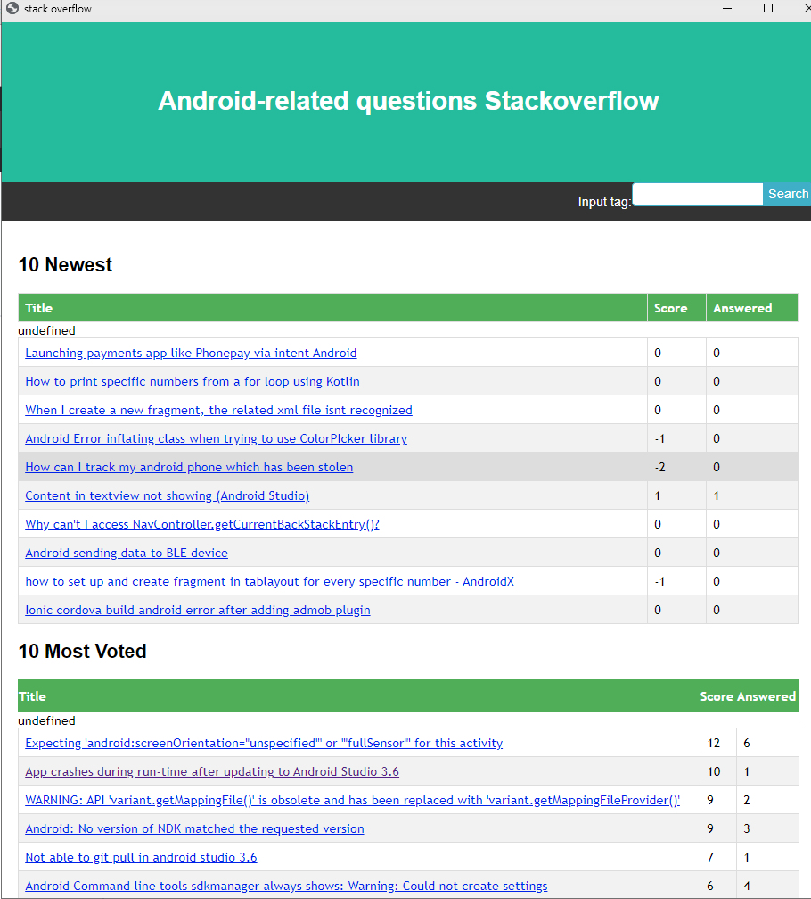

This is the implementation for displaying the titles of the extracted questions from StackOverflow.

# Android-related-questions-Stackoverflow


## Introduction
 


This website is used for extracting topic-related questions from [StackOverflow](https://stackoverflow.com/). 
After submitted your interesting topic through the search bar on the upper-right corner, this website would extract from [StackOverflow](https://stackoverflow.com/)
the ```10 newest topic-related questions```, as well as the ```10 most voted topic-related questions``` that are created ```in the past week```.


## Instructions
### Pycharm setup 
1. Download [Pyacharm 2019](https://www.jetbrains.com/pycharm/download/#section=linux) ([you could follow the process in this video](https://www.youtube.com/watch?v=YxHplztMQMc)). Go to `File` -> `Open` and choose the project where it's downloaded.
2. Go to `File` -> `Settings`.  In the prompt window, select `Project:Android-related-questions-Stackoverflow` -> `Project Interpreter` on the left panel. At the top of the right panel,  click the `gear` icon to add a Python Interpreter with environment `Python 3.7`.
3. In the virtual environment under the same panel, install the following dependencies:

 - eel v 0.12.2
 - json5 v 0.8.5
 - requests v 2.21.0
 - jinja2 v 2.11.1


#### Process
* Open the `/Android-related-questions-Stackoverflow/Web.py` file.
* Click the green `Run` Button.
  

## Contact

If you have ang issue,please concat ziyi.liu1@ucalgary.ca

